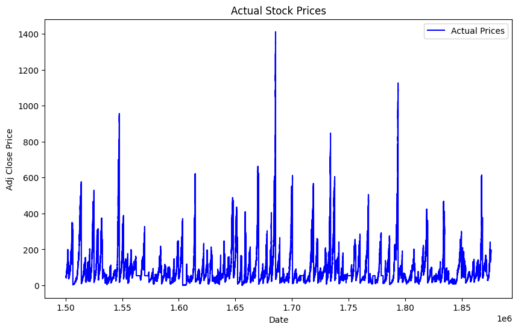
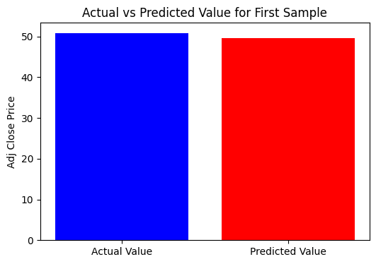

# 📈 Stock Prediction for S&P 500

## 🌟 Project Overview

This project focuses on predicting the stock performance of companies listed in the **S&P 500**, one of the most prominent financial benchmarks worldwide. The dataset used in this project includes historical stock data, and the goal is to analyze and predict stock trends using multiple machine learning models.

## 📊 Dataset

The dataset consists of historical data of the **S&P 500** stocks, covering key financial indicators such as stock prices and company performance metrics. The dataset is loaded from a CSV file (`sp500_stocks.csv`) and processed using Python's data manipulation libraries.

Actual Prices 



## 🛠️ Libraries and Dependencies

The project utilizes the following libraries:

- `pandas`: For data manipulation and analysis 📑
- `numpy`: For numerical computations 🔢
- `scikit-learn`: For machine learning models and evaluation ⚙️
- `xgboost`: For implementing XGBoost model 🧠
- `matplotlib`/`seaborn`: For data visualization 📊

## ⚙️ Data Preprocessing

Before feeding the data into the models, the following preprocessing steps are taken:

- Data loading and inspection using `pandas`.
- Handling missing values, normalization, and feature scaling as required.
- Feature engineering to create new useful features from existing data.

## 🧠 Models Used

Three machine learning models were employed to predict stock prices:

1. **XGBoost**: A high-performance, gradient-boosting model that is well-suited for tabular data.
2. **Random Forest Regressor**: An ensemble learning method that builds multiple decision trees to improve prediction accuracy.
3. **Support Vector Regression (SVR)**: A regression model that uses support vectors to predict continuous values.

## 🏆 Model Evaluation and Results

### Evaluation of **XGBoost**:
- **Mean Squared Error (MSE)**: While the MSE is not excessively high, the model struggles to accurately capture **extreme price spikes or falls**. XGBoost's inability to handle volatility well indicates its limitations in reacting to sudden market changes.
- **Mean Absolute Error (MAE)**: The model's average error is approximately **2.99 units** of the adjusted closing price. Given the wide range of stock prices in the dataset, this is an **acceptable error margin**, although it could be improved for extreme price fluctuations.
- **Limitations**: XGBoost tends to **overshoot or undershoot** during large price swings, making it less reliable for predicting stock prices during periods of high volatility. While XGBoost is generally a powerful model, it might be struggling to capture sudden price changes or market volatility accurately in this case.

### Evaluation of **Random Forest Regressor**:
- **Mean Squared Error (MSE)**: A **lower MSE** indicates that Random Forest is better at capturing the overall variability of stock prices compared to XGBoost.
- **Mean Absolute Error (MAE)**: With an MAE of **2.46 units**, the model offers **reasonable accuracy**, especially considering the inherent complexity of stock price data. This represents a notable improvement over XGBoost.
- **Performance**: The predicted prices (red line) follow the actual stock prices (blue line) closely in most cases. However, like XGBoost, Random Forest still **struggles with extreme price spikes**, though to a lesser degree. Random Forest's strength lies in its ability to capture the general trend of stock prices while maintaining a relatively low prediction error.

### Evaluation of **Support Vector Regression (SVR)**:
- **Mean Squared Error (MSE)**: With an MSE of **686.30**, SVR clearly underperforms compared to the other models, indicating its **inability to capture patterns** effectively.
- **Mean Absolute Error (MAE)**: The model's predictions are off by about **12.18 units** on average, a significant deviation from the actual prices. This large error margin highlights SVR's struggle to accurately predict stock prices, especially during **sharp changes** and **volatile periods**.
- **Limitations**: The SVR model tends to **overestimate and exaggerate peaks**, leading to large deviations between predicted and actual prices. Its failure to handle sharp price movements makes it the weakest performer among the three models.

### 🏆 **Best Performing Model**: **Random Forest Regressor**

Out of the three models evaluated, **Random Forest Regressor** outperformed both XGBoost and SVR. Its ability to better capture the variability of stock prices, combined with a **lower MSE and MAE**, makes it the most reliable model for this particular stock prediction task. While it still faces challenges with extreme price spikes, Random Forest demonstrated the best balance between prediction accuracy and handling general price trends in the stock market.


## 🖥️ Installation

To run this project, follow these steps:

1. Clone the repository:
   ```bash
   git clone <repository-url>
   ```

2. Install the required libraries:
   ```bash
   pip install -r requirements.txt
   ```

## 🚀 Usage

To execute the project and view the stock predictions:

1. Open the Jupyter notebook (`stock-prediction.ipynb`).
2. Run the cells sequentially to load the dataset, preprocess the data, train the models, and evaluate their performance.

## 📈 Output

The project provides the following outputs:

- **Stock Trend Visualizations** 📉: Graphs showing stock price trends over time.
- **Model Predictions** 🏷️: Predictions generated by each model for stock prices.
- **Performance Evaluation** 🏆: A comparison of the models using metrics like Mean Squared Error (MSE) and R-squared values.

XGBoost Actual vs Predicted Prices


XGBOOST Predicted vs Actual Value for a Sample



## 🔮 Future Work

- Integrate real-time stock data for live predictions 📅.
- Explore more advanced algorithms or deep learning methods for better accuracy.
- Incorporate external features like market news or sentiment analysis 📰.
- Research on various parameters
